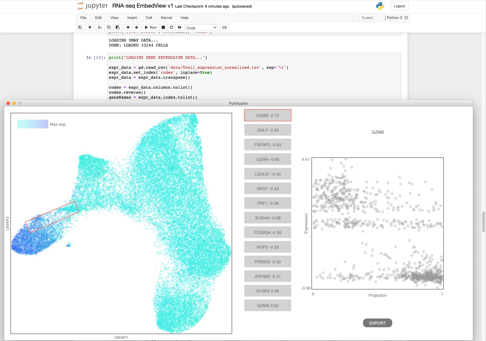

# RNA-seq Embedding Viewer

This prototype of an RNA-seq Embedding Viewer allows exploring an UMAP embedding of single-cell RNA-seq data. The user can select directions in the UMAP plane, and the viewer will calculate the genes with the highest correlation with those directions. It is available as a stand-along Processing sketch and as a Jupyter notebook.


## Installation
- Prepare conda environment containing dependencies for py5:
  ```conda env create -n py5coding -f http://py5.ixora.io/install/py5_environment.yml```
- Activate the environment created above:
  ```conda activate py5coding```
- Install the umap_explorer package in this repo:
  ```python setup.py install```
- To uninstall:
  ```pip uninstall umap-explorer```
- To load the module from a notebook wihtout installing (good for debugging), add the following imports to the notebook:
  ```
  import sys
  sys.path.append('../umap_explorer')
  from umap_explorer import UMAPexplorer
  ```

## Jupyter notebook

This Jupyter notebook demonstrates the use of [py5](http://py5.ixora.io/), a version of Processing for Python, to create an interactive viewer of RNA-seq embedding data. Find it under the notebook folder.

Processing's drawing API and engine can be run from a Jupyter notebook to enable users explore their datasets and then bring the results of their exploration directly into the notebook for further analysis:


The datasets can be quite large, as seen in the next image:



## Processing sketch

The viewer can be run as a Processing sketch, or export from the PDE as a stand-alone application. Its functionality is identical to the Jupyter notebook. Available under the standalone folder.


