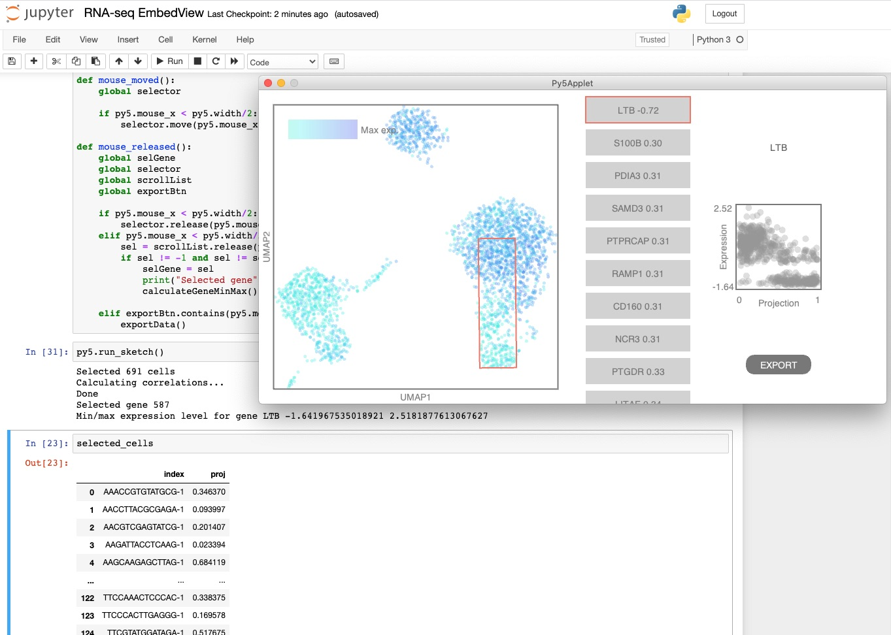

# Single Cell Interactive Viewer (sciviewer)

This is an interactive viewer for 2D embeddings such as [UMAP](https://umap-learn.readthedocs.io/en/latest/) or [tSNE](https://lvdmaaten.github.io/tsne/) of high dimensional single-cell RNA-seq data. The user can select cells in the 2D plane and the viewer will calculate the differential expression between the selected and the unselected cells. Alternatively, the user can select a group of cells and a direction and the viewer will identify the genes with the greatest variation (Pearson correlation) along that direction. See snapshots of how this works below as well as the examples included in this repository (a small example of [3000 PBMCs](./examples/sciviewer_example_3K_PBMC.ipynb) and a larger one of [50,000 circulating T-cells](./examples/sciviewer_example_50K_Tcell.ipynb)).

## Installation

The main requirement for sciviewer is [py5](http://py5.ixora.io/install/) which in turn requires Python 3.8. We recommend using the conda package manager to install the necessary dependencies fo sciviewer. Conda can be installed following the instructions [here](https://docs.conda.io/en/latest/miniconda.html). Then follow the steps below to install sciviewer.

1. Prepare and activate the conda environment containing dependencies for py5:

```
conda env create -n sciviewer -f https://raw.githubusercontent.com/colabobio/sciviewer/master/sciviewer-env.yml
conda activate sciviewer
```
Alternatively, if you want to append the needed dependencies to an existing conda environment, instead of creating a new one, you can do the following:

```
conda env update -n your_existing_environment -f https://raw.githubusercontent.com/colabobio/sciviewer/master/sciviewer-env.yml
conda activate your_existing_environment
```

2. Next, install the sciviewer package using pip:
```
pip install sciviewer
```

And that is it, the module is now installed and ready to be used.

To uninstall, use:
```
pip uninstall sciviewer
```

## Quick start

Sciviewer is executed from a Jupyter notebook such as in the examples directory. It is run by initializing a SCIViewer class with the 2D embedding (# cells X 2) and the expression data (# cells X # genes). E.g.

```
from sciviewer import SCIViewer
svobj = SCIViewer(umap, expr)
svobj.explore_data()
```


Running the code above will cause the visualizer to appear. The user selects cells in 2 steps. first clicking and dragging to define an initial axis, 


 - The expression data can be provided as a Pandas DataFrame, a Numpy ndarray, or as a scipy sparse [csc_matrix](https://docs.scipy.org/doc/scipy/reference/generated/scipy.sparse.csr_matrix.html).
 - Providing the data as a csc_matrix is recommended for large datasets as it can lead to a considerable (1-2 order or magnitude) performance speedup.
 - If the expression data is provided as a Pandas DataFrame, the cell names are inferred from the index and the gene names are inferred from the columns. Otherwise, the gene names and cell names can be provided when initializing the SCIViewer class with the gene_names and cell_names arguments.
 - See the example notebooks for more details


It takes 2 primary inputs, 

This Jupyter notebook demonstrates the use of [py5](http://py5.ixora.io/), a version of Processing for Python, to create an interactive viewer of RNA-seq embedding data. Find it under the notebook folder.

Processing's drawing API and engine can be run from a Jupyter notebook to enable users explore their datasets and then bring the results of their exploration directly into the notebook for further analysis:



The datasets can be quite large, as seen in the next image:


## Development / debugging

For development purposes, it can be helpful to import sciviewer directly rather than installing the package. See the extras/debugging directory for notebooks with examples of how to do this e.g. [debug_example_3K_PBMC.ipynb](extras/debugging/debug_example_3K_PBMC.ipynb).

